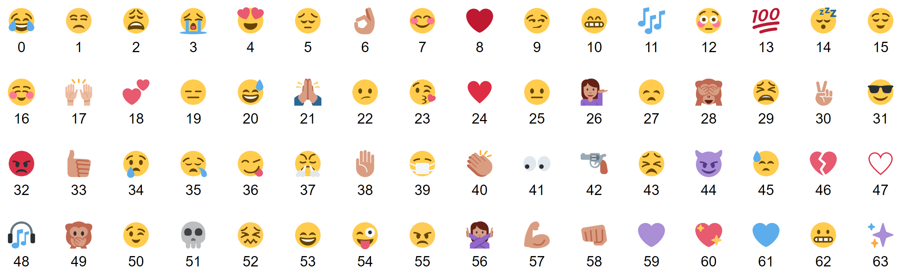

# Outline
- Motivation
- Methodology
- Conclusions
- Demo

# Motivation

- Previous models limited by binary classification and/or manual categorization
- To detect emotion in text

# Methodology

- Train on 1.2 billion tweet corpus and 64 commonly used emojis

# Conclusions

# [Demo](https://deepmoji.mit.edu/)
